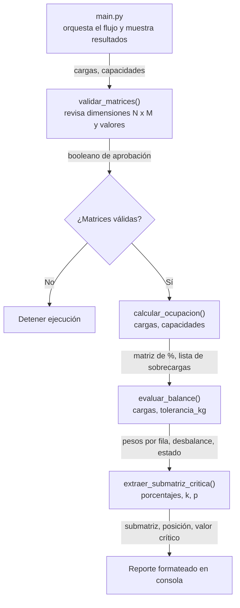

# Cargo Hold — Análisis de Distribución de Carga en Bodega de Aeronave

Sistema en Python para validar, calcular y evaluar la distribución de peso
en el piso de carga (*cargo hold*) de una aeronave, modelado como una
matriz bidimensional de N filas (dirección longitudinal) por M columnas
(dirección transversal).

## Tabla de contenidos

- [Explicación del problema](#explicación-del-problema)
- [Arquitectura modular](#arquitectura-modular)
- [Análisis de complejidad computacional](#análisis-de-complejidad-computacional)
- [Estructura del repositorio](#estructura-del-repositorio)
- [Instalación y uso](#instalación-y-uso)
- [Pruebas unitarias](#pruebas-unitarias)
- [Fórmulas y reglas de negocio](#fórmulas-y-reglas-de-negocio)

## Explicación del problema

En el transporte aéreo de carga, la forma en que se distribuye el peso
sobre el piso de la bodega no es un detalle logístico menor: es una
condición de seguridad operacional. Dos riesgos concretos motivan este
sistema:

1. **Capacidad estructural del piso.** Cada panel o compartimiento del
   piso de carga está diseñado para soportar un peso máximo. Superar ese
   límite en una sola celda puede deformar o dañar el fuselaje, incluso si
   el peso total de la aeronave está dentro de los límites generales de
   despegue. Por eso la validación debe hacerse **celda por celda**, no
   solo sobre el total.

2. **Balance y simetría de la aeronave.** Un avión mal balanceado
   lateralmente (más peso a babor que a estribor) genera un momento de
   alabeo que el piloto debe compensar constantemente, reduciendo la
   maniobrabilidad y, en casos extremos, comprometiendo el control del
   vuelo. De igual forma, el peso debe repartirse de manera razonable a
   lo largo del eje longitudinal para mantener el centro de gravedad
   dentro del rango certificado.

Este proyecto traduce ambos problemas en operaciones sobre matrices:
la sobrecarga se detecta comparando dos matrices celda a celda, y el
balance lateral se detecta comparando la suma de las columnas de la
mitad izquierda contra la mitad derecha.

## Arquitectura modular

El sistema sigue un diseño de **funciones puras**: cada módulo recibe
matrices y parámetros, y retorna nuevas estructuras de datos sin alterar
las entradas originales. `main.py` actúa como orquestador que encadena
las llamadas.



**Paso de parámetros entre funciones:**

| Función | Entradas | Salidas | Consumida por |
|---|---|---|---|
| `validar_matrices` | `cargas`, `capacidades` | `bool` | `main.py` (control de flujo) |
| `calcular_ocupacion` | `cargas`, `capacidades` (ya validadas) | `{porcentajes, sobrecargas}` | `evaluar_balance` (indirectamente vía `cargas`) y `extraer_submatriz_critica` (vía `porcentajes`) |
| `evaluar_balance` | `cargas`, `tolerancia_kg` | `{pesos_por_fila, desbalance_lateral, balance_aprobado}` | `main.py` (reporte) |
| `extraer_submatriz_critica` | `porcentajes`, `k`, `p`, `criterio` | `{submatriz, posicion, valor_criterio}` | `main.py` (reporte) |

Cada función es independiente y testeable de forma aislada porque no
depende de estado global ni de efectos secundarios: recibe datos,
retorna datos.

## Análisis de complejidad computacional

Sea **N** el número de filas y **M** el número de columnas de la bodega.

### `validar_matrices`
Recorre ambas matrices una vez para verificar regularidad y validez de
cada valor.
- **Tiempo:** O(N × M)
- **Memoria:** O(1) adicional (no crea nuevas estructuras, solo evalúa)

### `calcular_ocupacion`
Recorre cada celda exactamente una vez para calcular el porcentaje y
determinar si está en sobrecarga.
- **Tiempo:** O(N × M)
- **Memoria:** O(N × M) para la nueva matriz de porcentajes, más O(S) para
  la lista de sobrecargas, donde S ≤ N × M es el número de celdas
  sobrecargadas.

### `evaluar_balance`
Calcula la suma de cada fila (O(N × M) en total) y separa la suma de las
columnas izquierda/derecha, lo cual también implica recorrer cada celda
una vez.
- **Tiempo:** O(N × M)
- **Memoria:** O(N) para el vector de pesos por fila.

### `extraer_submatriz_critica`
Este es el módulo más sensible en términos de complejidad, porque una
implementación ingenua recorrería cada una de las O(N × M) posiciones de
ventana y, para cada una, sumaría sus k × p celdas, dando
O(N × M × k × p).

Para evitar esto, el proyecto usa el patrón de **matrices de sumas de
prefijos (prefix sums)**:

1. Se construye una matriz de prefijos en una sola pasada: O(N × M).
2. Cada suma de una ventana k × p se calcula luego en **tiempo
   constante O(1)** usando la matriz de prefijos, sin importar el tamaño
   de la ventana.
3. Como existen O(N × M) posiciones posibles para la ventana, evaluarlas
   todas cuesta O(N × M) en total.

- **Tiempo:** O(N × M) (construcción del prefijo + evaluación de
  ventanas, ambos lineales respecto al número de celdas)
- **Memoria:** O(N × M) para las matrices de prefijos.

### Conclusión general

Todas las operaciones del sistema son, en el peor caso, **O(N × M) en
tiempo** y **O(N × M) en memoria**, ya que ninguna función necesita más
de una vuelta lineal sobre la cuadrícula (o dos, en el caso de la
técnica de prefijos) para producir su resultado. Esto es apropiado para
el problema: cualquier algoritmo correcto debe, como mínimo, leer cada
celda de la bodega al menos una vez, por lo que O(N × M) es también una
cota inferior razonable (Ω(N × M)) para este tipo de análisis exhaustivo
de la cuadrícula.

## Estructura del repositorio

```
cargo_hold_project/
├── cargo_hold.py           # Módulo con las funciones de validación y cálculo
├── main.py                 # Script principal: flujo completo + datos de prueba
├── tests/
│   └── test_cargo_hold.py  # Pruebas unitarias (casos típicos y de borde)
├── README.md                # Este documento
└── .gitignore
```

## Instalación y uso

### Desde terminal / Google Colab

```bash
# Clonar el repositorio
git clone https://github.com/<tu-usuario>/<tu-repositorio>.git
cd <tu-repositorio>

# Ejecutar el script de demostración
python main.py
```

### Desde Google Colab

```python
# En una celda de Colab
!git clone https://github.com/<tu-usuario>/<tu-repositorio>.git
%cd <tu-repositorio>
!python main.py
```

### Uso del módulo 
```python
from cargo_hold import (
    validar_matrices,
    calcular_ocupacion,
    evaluar_balance,
    extraer_submatriz_critica,
)

cargas = [[500, 480], [700, 690]]
capacidades = [[600, 600], [800, 800]]

if validar_matrices(cargas, capacidades):
    resultado = calcular_ocupacion(cargas, capacidades)
    print(resultado["porcentajes"])
    print(resultado["sobrecargas"])
```

## Pruebas unitarias

```bash
python -m unittest tests/test_cargo_hold.py -v
```

La suite cubre, entre otros:
- Matrices válidas e inválidas (dimensiones distintas, filas irregulares,
  N o M menores a 2, pesos negativos, capacidades ≤ 0).
- Cálculo de ocupación, incluyendo el caso límite exacto de 100%
  (no debe considerarse sobrecarga).
- Balance con M par e impar (verificando que la columna central se omita
  correctamente cuando M es impar).
- Extracción de submatriz con ventanas típicas, ventana igual a la matriz
  completa, ventana 1×1, y errores por ventanas fuera de rango.

## Fórmulas y reglas de negocio

```
PorcentajeOcupacion(i, j) = (PesoReal(i, j) / CapacidadMaxima(i, j)) * 100.0

Condición de sobrecarga: PorcentajeOcupacion(i, j) > 100.0

PesoTotalFila(i) = Σ PesoReal(i, j)  para j = 0 .. M-1

DesbalanceLateral = | SumaPesosMitadIzquierda - SumaPesosMitadDerecha |
```

- Si **M es par**, la mitad izquierda son las columnas `[0, M/2)` y la
  derecha `[M/2, M)`.
- Si **M es impar**, la columna central (índice `M // 2`) se omite del
  cálculo por estar sobre el eje de simetría longitudinal de la
  aeronave.
